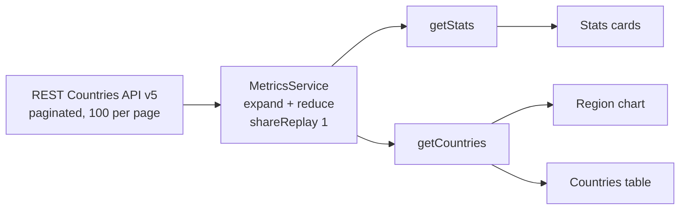

# Enterprise Dashboard

An Angular 21 dashboard that visualizes country and population data from the [REST Countries API](https://restcountries.com). I built it as a portfolio project to practice modern Angular: standalone components, signal-based APIs, the new control flow syntax, and RxJS for data fetching.


**Live demo:** https://enterprise-dashboard-ruby.vercel.app

## Features

- **Login flow with a route guard.** A functional `CanActivateFn` guard protects the dashboard route. Authentication is simulated on the client (see [Known limitations](#known-limitations)).
- **Stats cards.** Total countries, world population, number of regions, and average population, all calculated from the API data.
- **Region chart.** A Chart.js bar chart that shows total population per world region.
- **Countries table.** An Angular Material table of every country, sorted by population, with column sorting, text filtering, and pagination (10 / 25 / 50 rows).
- **Layout.** A sidebar you can collapse and a header with a user menu and logout.
- **One shared request.** The API is paginated, so the service walks every page, merges the results, and caches them. Every component reuses that single request.

## Tech stack

| Area | Technology |
|---|---|
| Framework | Angular 21 (standalone components, lazy-loaded routes) |
| Language | TypeScript 5.9 |
| UI | Angular Material + Angular CDK, SCSS |
| Charts | Chart.js 4 + ng2-charts |
| Reactivity | Angular Signals (`signal`, `effect`, `input()`, `output()`, `viewChild()`) |
| Data fetching | `HttpClient` + RxJS (`expand`, `reduce`, `shareReplay`) |
| Unit testing | Vitest via `@angular/build:unit-test` |
| Hosting | Vercel |

## How the data flows



`MetricsService` requests the first page. It then uses `expand` to keep requesting pages until `meta.more` is `false`, and uses `reduce` to combine all of them into one array. `shareReplay(1)` caches that array, so the stats cards, the chart, and the table read from the same result. The API is only called once per session.

## Angular APIs used

- Standalone components (no NgModules)
- Built-in control flow: `@if`, `@for`
- Signal inputs and outputs: `input()`, `output()`
- Signal queries: `viewChild()`, together with an `effect()` that connects `MatPaginator` and `MatSort` once they are available
- Component state kept in `signal()` (loading flags, sidebar state, filter value)
- Functional route guards and `loadComponent` for lazy loading

## Getting started

### Prerequisites

- Node.js `^20.19.0`, `^22.12.0`, or `>=24.0.0` (required by Angular 21)
- npm
- A free REST Countries API key from [restcountries.com](https://restcountries.com)

### Installation

```bash
git clone https://github.com/LuisRuiz2108/enterprise-dashboard.git
cd enterprise-dashboard
npm install
```

Add your API key to `src/environments/environment.ts`:

```ts
export const environment = {
  restCountriesApiKey: 'YOUR_API_KEY',
};
```

> This is a client-side app, so the key is included in the browser bundle and anyone can see it. Use a key restricted to your domain.

Then start the dev server:

```bash
npm start
```

Open http://localhost:4200.

### Demo credentials

```
Email:    admin@dashboard.com
Password: admin123
```

## Scripts

| Command | Description |
|---|---|
| `npm start` | Start the dev server |
| `npm run build` | Create a production build in `dist/` |
| `npm run watch` | Rebuild on file changes (development configuration) |
| `npm test` | Run unit tests with Vitest |

## Project structure

```
src/
├── app/
│   ├── components/
│   │   ├── data-table/      # Material table: sort, filter, paginate
│   │   ├── header/          # Toolbar, user menu, sidebar toggle
│   │   ├── region-chart/    # Chart.js population-by-region bar chart
│   │   ├── sidebar/         # Collapsible side navigation
│   │   └── stats-card/      # KPI card (signal inputs)
│   ├── guards/
│   │   └── auth-guard.ts    # Functional CanActivateFn
│   ├── pages/
│   │   ├── dashboard/       # Main layout, composes all components
│   │   └── login/
│   ├── services/
│   │   ├── auth.service.ts      # Simulated auth (localStorage)
│   │   └── metrics.service.ts   # API pagination, caching, data mapping
│   ├── app.config.ts
│   └── app.routes.ts        # Lazy-loaded routes
├── environments/
│   └── environment.ts       # API key
└── styles.scss
```

## Known limitations

This is a learning project. These are the things I know it doesn't do yet:

- **Authentication is simulated.** The credentials are hardcoded, and the session is just a flag in `localStorage`. There is no backend or token handling.
- **The trend percentages on the stats cards are placeholder values.** The main numbers come from the API, but the percentage changes are fixed.
- **The sidebar links are placeholders.** Every nav item goes to `/dashboard`.
- **Test coverage is minimal.** The spec files only contain the default creation tests.
- **Change detection is zone-based.** The app uses zone.js (`provideZoneChangeDetection`) instead of zoneless change detection.
- **Some code still uses older patterns.** Dependencies are injected through the constructor instead of `inject()`, and some components subscribe in `ngOnInit` instead of using `toSignal()`.

## Author

**Luis Eduardo Ruiz Sanchez**, Software Engineer (Frontend & CI/CD)
[LinkedIn](https://www.linkedin.com/in/luis-eduardo-ruiz-sanchez-85b979183/) · [GitHub](https://github.com/LuisRuiz2108)
